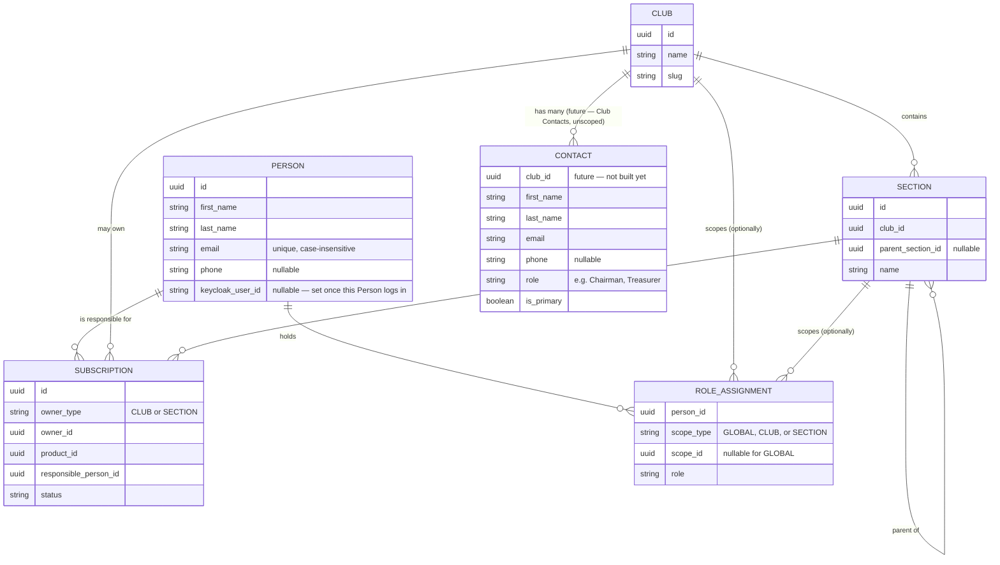
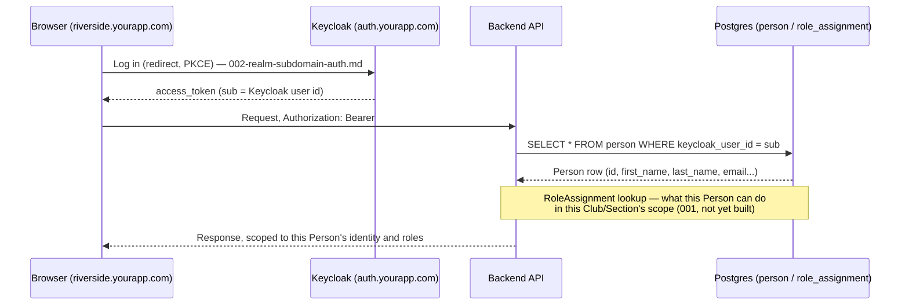
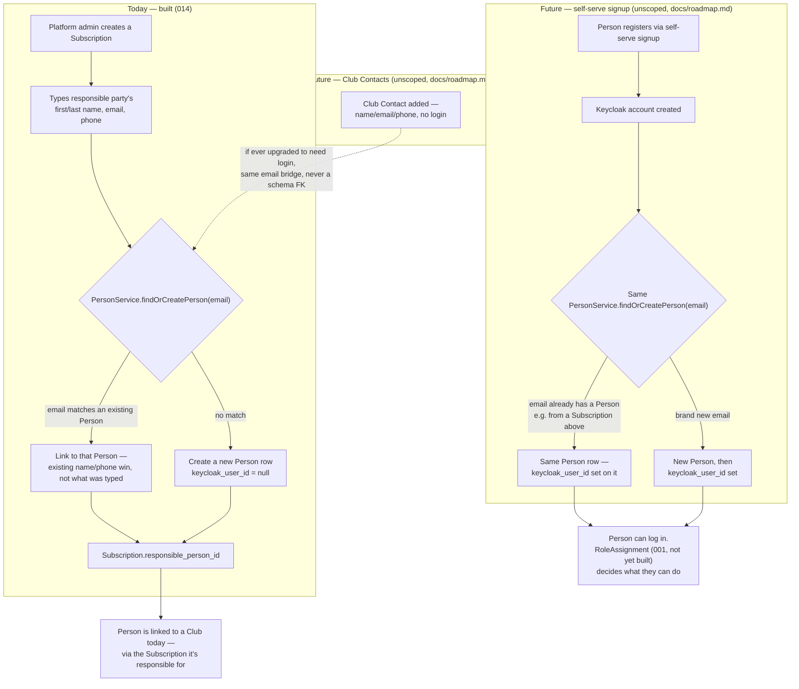

# Architecture — Identity, Tenancy & Auth

A living map of how a human becomes a `Person`, how that `Person` relates to a `Club`, and how login (Keycloak) fits in. Not a spec — it doesn't gate implementation and carries no requirements of its own. Update it whenever a spec changes `Person`/`Contact`/`RoleAssignment`/`Club`/`Subscription`'s shape or relationships, the same living-doc discipline `docs/roadmap.md` already follows. Each diagram notes what's actually built today vs. what a named, still-unscoped future spec owns — don't let this file imply something exists before it does.

## Data model — how the pieces relate

- **`PERSON`** — global, one row per human, forever (`001-tenancy-identity-model.md`). The only entity a Keycloak login ever attaches to.
- **`ROLE_ASSIGNMENT`** — the administrative-capability grant, scoped to `GLOBAL`/`CLUB`/`SECTION`. Named in `001`, **not yet built** anywhere in code.
- **`CONTACT`** — a named point of contact *for a Club* (chairman, treasurer, groundskeeper...), **not built yet** (the "Club Contacts" spec, `docs/roadmap.md`). One `Club` has many `Contact` rows — a real, ordinary foreign key, same shape as `Club` → `Section`. No inherent login capability.
- `SUBSCRIPTION.responsible_person_id` (`014`) is the first real edge from `PERSON` to the rest of the tenancy model — a `Person` gets linked to a `Club` today by being accountable for its `Subscription`, well before any login or role exists.

**The one relationship that's genuinely *not* in this diagram: `Contact` → `Person`.** Unlike `Contact`'s very real FK to `Club` above, it never gets a foreign key to `Person` — that link, when it exists at all, is resolved at runtime by matching email addresses, not stored in the schema. See the flowchart below for exactly how and when that happens.

## Login — resolving a request back to a `Person`

One shared Keycloak realm across every club (`002`) — the subdomain picks which club's data a request is scoped to, not which realm handles the login. `sub` (the Keycloak user id) is the only thing that ever maps to `Person.keycloak_user_id`; nothing else identifies a logged-in human.

## How a human becomes a `Person` — today vs. what's next

**The load-bearing idea:** `PersonService.findOrCreatePerson(email)` is the one resolution point every door into `Person` goes through — a Subscription's responsible party today, self-serve signup tomorrow, a Club Contact's optional login upgrade whenever that's needed. Email is the only key that bridges them; none of these paths ever gain a schema-level FK to each other. A human can arrive at the same `Person` row through any of these doors without the system ever creating a duplicate identity.

**What none of this grants by itself:** a `Person` existing — through any path above — implies zero login and zero administrative capability on its own. Login only exists once `keycloak_user_id` is actually set (self-serve signup, unbuilt). Administrative capability only exists once a `RoleAssignment` row exists (`001`, unbuilt). Both are separate, later, deliberate grants — see `014`'s Non-goals for why this spec stops short of either.
