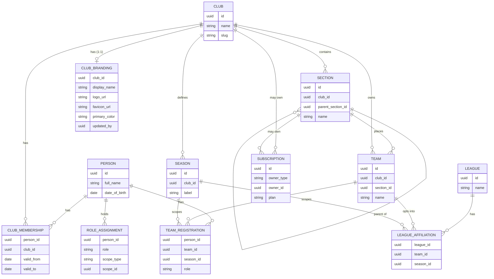
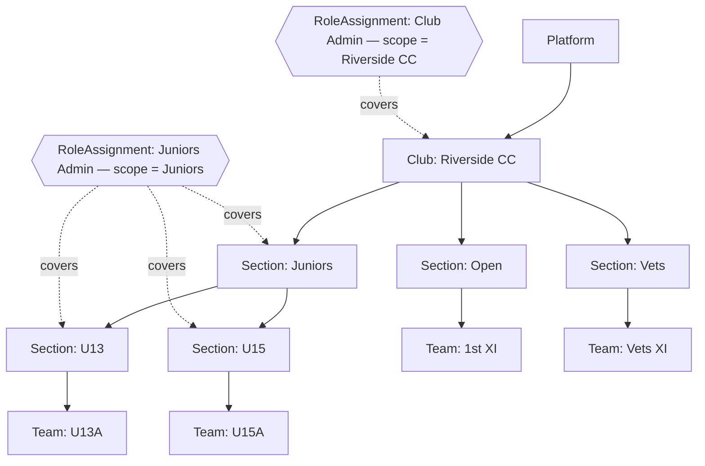

# 001 — Tenancy & Identity Model

**Depends on:** nothing — this is the foundation everything else (including `002-realm-subdomain-auth.md`) sits on.
**Status:** proposed, unreviewed against a real club's actual structure yet.

A club selling to other clubs and a junior ageing into the Open side look like unrelated problems. They aren't.

## The Core Insight

Both are an instance of the same shape: **one permanent identity, many time-boxed memberships in scoped groups.** A club is just the outermost scope; a section, age-group, or team is a scope nested inside it. Model that once, and club isolation, league-wide stats, section-scoped admins, and player continuity all fall out of the same handful of tables — instead of four separate special cases that quietly drift out of sync with each other.

> **The one sentence to remember:** `Person` never changes. Everything that changes — which club, which section, which team, which season — is a separate, dated row pointing back at the same `Person`.

## Entity Model

Ten entities. `Person`, `League`, and `LeagueAffiliation` are the only ones that intentionally cross club boundaries — everything else is tenant-scoped by `club_id`.



> **Why `Section` is self-referential, not a fixed Section/Division split:** every club structures its age groups differently — some split Juniors into U11/U13/U15, others also split a single age group into A/B grades. A self-referential `Section` (each row can have a `parent_section_id`) supports "Juniors → U13 → U13A" or just "Open" with no children, using one table and one recursive rule, instead of hard-coding how many levels deep a club is allowed to go.

> **Naming: `Section` is the internal/technical term only.** User testing (a club committee member walking through an early design) found "Section" confusing on its own — they understood it instantly once described as "Age Groups." But the entity covers more than age groups (`Open`, `Vets`, and grade splits like `U13A`/`U13B` aren't age groups), so renaming the entity itself to `AgeGroup` would make the model *less* accurate, not more. The fix is at the UI-copy layer, not the model: user-facing screens and marketing copy should say "Age Group" or "Grade" (whichever fits the specific node), never bare "Section," while the entity/table/API name stays `Section` everywhere in code and specs. `006-post-login-home-shells.md`'s Manager nav card already does this — it's labelled "Sections & Age Groups," not "Sections."

## Scope Hierarchy & Access

A `RoleAssignment` binds a role to a scope — `PLATFORM`, `CLUB`, `SECTION`, or `TEAM` — and covers everything nested beneath that scope node. A juniors administrator's assignment sits on the Juniors `Section`; it automatically covers every age group under it and nothing outside it, with no "juniors" special case written anywhere in code.



**The one rule that resolves every scope check:**

```
canAdminister(roleAssignment, team):
    match roleAssignment.scope_type:
        PLATFORM → true
        CLUB     → team.club_id == roleAssignment.scope_id
        SECTION  → roleAssignment.scope_id is team.section_id
                   or an ancestor of it (walk parent_section_id)
        TEAM     → team.id == roleAssignment.scope_id
```

One recursive check, reused for every role — club admin, section admin, team manager — instead of a bespoke permission path per role name. `docs/standards/backend.md` shows how this lands as `@PreAuthorize("@access.canAdminister(...)")`.

## Solving the Three Problems

**Sell to other clubs without roster overlap — Club isolation.**
Every club-scoped table carries `club_id`, enforced with Postgres row-level security. Onboarding a new customer creates one new `Club` row; by default it has zero visibility into any other club's sections, teams, or rosters. If a player happens to be known to two clubs, they're still one `Person` — a transfer just closes one `ClubMembership` row and opens another. Neither club gets access to the other's team data because of it.

**League-wide stats across clubs — Deliberate seam.**
`League` and `LeagueAffiliation` are the one place cross-club visibility is intentional rather than a leak. A club opts a specific team into a league for a season; league-wide stat queries join match results through that affiliation and are scoped to teams that actually opted in — never a club's full roster or admin surface.

**Juniors admin sees only juniors — Scoped RBAC.**
Covered by the scope hierarchy above — a `RoleAssignment` at the Juniors `Section` node, resolved by the same recursive-descendant rule used for every other scope level. Works identically if a club later adds a "Girls" section, a "Colts" section, or reorganises its age groups.

**Players move age groups, no new profile — Identity continuity.**

| Season | TeamRegistration |
|---|---|
| 2022 | Person #4471 → U13A |
| 2024 | Person #4471 → U15A |
| 2026 | Person #4471 → Open 1st XI |

Same `Person` row throughout — only `TeamRegistration` changes, once per season. A career stats view is one query: every `PlayerResult` reachable from any `TeamRegistration` belonging to that `Person`, regardless of how many sections or teams they've passed through. `ClubMembership` never closes in this example — it's the same club the whole way, which is exactly why the model separates "which club" from "which team this season."

## Decision Log

**ADR-01 — One active club membership at a time.** *Decided.*
A `Person` may have many `ClubMembership` rows over time, but at most one with `valid_to IS NULL` — enforced with a partial unique index.
*Why:* no current need for a player to be simultaneously active at two clubs; keeps membership handling simple.
*Reversible?* Yes — dropping the partial unique index allows concurrent memberships later. No data migration required.

**ADR-02 — League is reporting/aggregation only.** *Decided.*
`League` has no admin role, fixture scheduling, or standings-management surface. It's a target for `LeagueAffiliation` rows and a read path for cross-club stats.
*Why:* not running leagues on the vendor's behalf yet; building league administration now would be speculative scope.
*Reversible?* Yes — add `LEAGUE` as a fifth `scope_type` on `RoleAssignment` when needed. Doesn't touch `Person`, `Club`, or `Section`.

**ADR-03 — Sections can hold their own subscription.** *Decided.*
`Subscription.owner_type` is `CLUB` or `SECTION`. A team's effective plan is resolved by walking up its `Section` ancestry for the nearest `Subscription`, falling back to the `Club`'s own.
*Why:* a juniors committee may hold its own budget separate from the senior club — billing needs to follow that.
*Reversible?* Partially — easy to add section-level billing later if v1 ships club-only, harder to remove once clubs rely on it. Ship as specified now.

**ADR-04 — Tenant resolved by subdomain, not custom domain.** *Decided.*
`Club.slug` maps to `{slug}.yourapp.com`. One wildcard cert and one DNS entry cover every club; branding resolves from the hostname before login.
*Why:* pre-login branding for free without per-club DNS/SSL operations at onboarding time.
*Reversible?* Yes — add an optional `custom_domain` column later; subdomain stays the default/fallback.
*Resolved in detail by:* `002-realm-subdomain-auth.md`.

**ADR-05 — Branding is a fixed token set, never open theming.** *Decided.*
`ClubBranding` exposes a small, closed set of fields — logo, favicon, display name, one or two brand colours. No custom CSS or arbitrary style overrides.
*Why:* keeps every club's instance feeling like the same well-built product wearing different colours, and protects the design-system principles (`docs/standards/design-system.md`) from being undone per-tenant.
*Reversible?* Additive only — more brand tokens can be added to the fixed set later.

**ADR-06 — Club admins can self-edit their own branding.** *Decided.*
Writing `ClubBranding` reuses the scope check above: a `RoleAssignment` with `scope_type = PLATFORM` or `scope_type = CLUB` matching that club can edit it.
*Why:* lets a club swap a logo or tweak a colour without going through the vendor after initial onboarding, while ADR-05's fixed-token constraint keeps it safe to hand over.
*Reversible?* Yes — trivially tightened back to platform-only.

## Field Reference

| Entity | Scope | Key fields | Purpose |
|---|---|---|---|
| Person | Global | id, full_name, date_of_birth, keycloak_user_id? | One row per human, forever |
| Club | Root tenant | id, name, slug | Billing/admin boundary, isolated by RLS; slug drives subdomain resolution |
| Section | Club | id, club_id, parent_section_id?, name | Self-referential age-group / grade tree |
| Team | Club | id, club_id, section_id, name | Where a squad currently sits in the tree |
| Season | Club | id, club_id, label, start_date, end_date | Scopes registrations and league affiliation |
| ClubMembership | Club ↔ Person | person_id, club_id, valid_from, valid_to? | One active row per person (ADR-01) |
| TeamRegistration | Team ↔ Person ↔ Season | person_id, team_id, season_id, role | The row that changes every time a player moves group |
| RoleAssignment | Person | person_id, role, scope_type, scope_id? | One mechanism for club/section/team admin |
| League | Global | id, name | Cross-club stat/fixture aggregation target |
| LeagueAffiliation | League ↔ Team ↔ Season | league_id, team_id, season_id | Explicit per-season opt-in, the only club-crossing join |
| Subscription | Club or Section | id, owner_type, owner_id, plan, status | Billing unit resolution (ADR-03) |
| ClubBranding | Club (1:1) | club_id, display_name, logo_url, favicon_url, primary_color, updated_by | The fixed token set a club's admins can self-edit (ADR-05, ADR-06) |

## White-Labelling

Because `Club` is already the tenant boundary, white-labelling doesn't need a new architectural concept — one new 1:1 entity, one hostname-resolution step ahead of everything else, and a firm line between what varies per club and what never does.

**Resolving the tenant before a single query runs:**

```
Request arrives at riverside.yourapp.com/schedule
  → reverse proxy passes Host header through
  → API resolves club_id from Club.slug = "riverside"      (public endpoints)
  → ...or cross-checks it against the logged-in user's
    active ClubMembership.club_id                            (authenticated endpoints)
  → frontend fetches GET /public/branding?slug=riverside
    before first paint, sets CSS custom properties, renders
```

This is why resolving the club from the URL rather than from a logged-in session matters: it's what lets a public schedule or public tournament page — pages that exist specifically to be seen by people without an account — show the right club's logo and colours at all. Full auth-flow detail in `002-realm-subdomain-auth.md`.

**Two token layers, not one.** See `docs/standards/design-system.md` for the full breakdown — structural tokens (spacing, type, breakpoints) are build-time and never vary per club; brand tokens (logo, colour, name) are runtime and always do.

**Marketing site vs. club instance.** The root domain (`yourapp.com`) is the vendor's own sales/marketing site — never club-branded. Every club subdomain skips that entirely and resolves straight into that club's public and member content.

## Deliberately Deferred

- **Concurrent club membership** — a player at two clubs at once (rep sides, dual registration). ADR-01 defers this; the schema change to re-enable it is small and isolated.
- **Vendor-run league administration** — fixture scheduling, standings, a league-admin role. ADR-02 defers this to a `LEAGUE` scope type added later, without touching the core model.
- **Section subscription lapse behaviour** — what a team sees/loses if its section's independent subscription expires while the parent club's is active. A product decision, not an architecture one — needs its own short spec before section-level billing ships.
- **Team season-history** — this model tracks a team's *current* section placement, not its grade history season to season. Add a `TeamSeasonPlacement` join only if grade history turns out to matter.
- **Custom domains per club** — ADR-04 ships subdomains only; a club fully hiding `yourapp.com` behind its own domain is a later, opt-in upgrade.
- **Per-section branding** — branding is Club-scoped only. Revisit only if a real club asks for a visibly distinct Juniors identity.

## Before treating this spec as final

Walk the scope-hierarchy diagram above against your actual club's real section/team layout.
