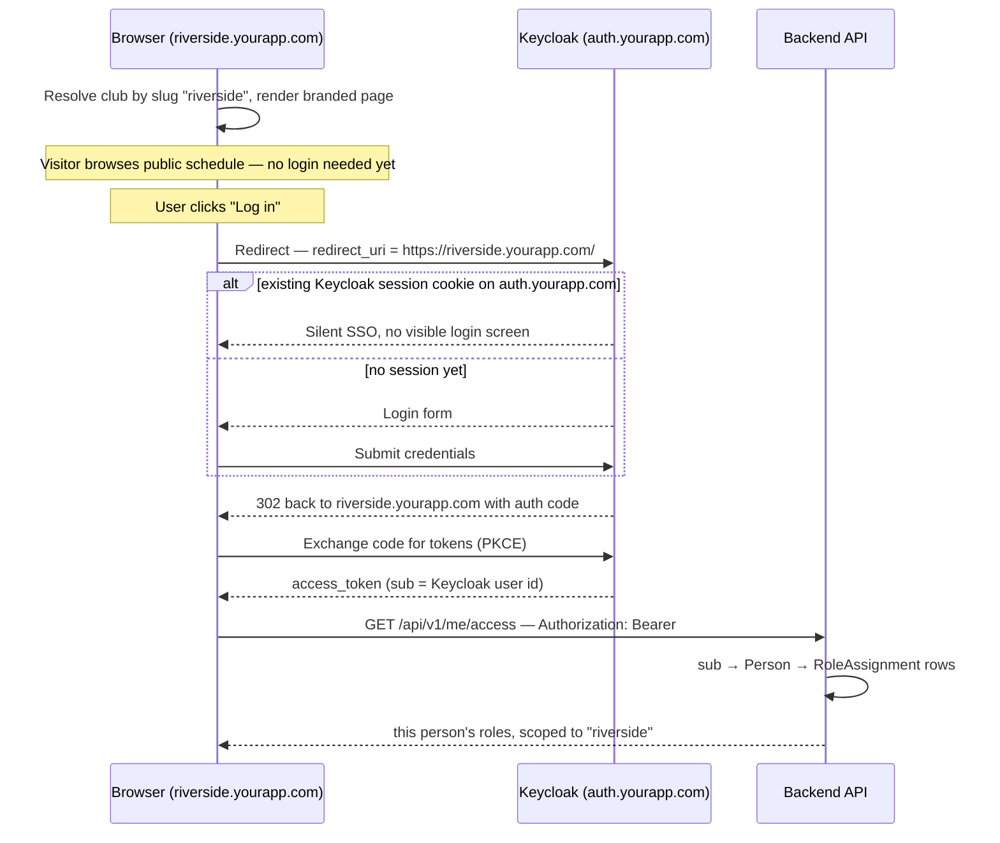

# 002 — Realm & Subdomain Auth

**Depends on:** `001-tenancy-identity-model.md`. **Resolves:** that spec's ADR-04 open item.
**Status:** proposed — ADR-03 below needs a version-specific spike before production.

The Tenancy model closed with an open item: subdomain resolution needs Keycloak to actually cooperate with per-club hostnames, and the original Cricket Legend pattern — one realm, flat `realm_access.roles`, read straight off the JWT by `useAuth()` — was built for a single tenant. Bolting subdomains onto that pattern without rethinking it would mean either a Keycloak role per club (doesn't scale) or roles that can't express "admin of Juniors, nothing else" at all. This spec settles both: which parts of the auth story stay in Keycloak, and which move into the scoped `RoleAssignment` model from `001-tenancy-identity-model.md`.

## Realm Strategy

**One realm, shared by every club, per environment** — `platform-dev` / `platform-staging` / `platform-prod`, never a realm per club.

- **Chosen — single shared realm.** Matches the Tenancy model: `Person` is one global identity. A player transferring clubs, or a platform-scoped operator working across every club, needs exactly one Keycloak account either way.
- **Rejected — realm per club.** Would force a new Keycloak account the moment `ClubMembership` changes — directly contradicting "no duplicate profiles." Also multiplies realm administration by every club sold.

## Identity vs. Authorization

The single most important shift from the original Cricket Legend pattern: **Keycloak proves who someone is; it no longer decides what they can do.** That decision moves entirely into the `RoleAssignment` table from `001-tenancy-identity-model.md`.

> **Why the split:** Keycloak realm/client roles are flat — one role, one name, no attached scope. "Juniors admin at Riverside" isn't a role Keycloak roles can express without either a role per club×section (explodes fast, and can't be created ahead of a club existing) or client-side attribute hacks. The `RoleAssignment(person, role, scope_type, scope_id)` row already solves this in the app's own database.

**What changes vs. the original app's pattern:**

| Original Cricket Legend | This project |
|---|---|
| `KeycloakJwtConverter` maps `realm_access.roles` → `ROLE_x` authorities | Maps JWT `sub` → `Person.keycloak_user_id` → loads that person's `RoleAssignment` rows into the security context |
| `@PreAuthorize("hasRole('manager')")` | `@PreAuthorize("@access.canAdminister(authentication, #teamId)")` — the scope-walk rule from `001-tenancy-identity-model.md` |
| Frontend `useAuth()` reads `keycloak.realmAccess.roles` directly | Frontend calls `GET /api/v1/me/access` once after login, gets resolved role assignments for the current club, caches it |

Keycloak keeps exactly one realm-level role worth keeping global: a small `platform_admin` flag for the vendor's own team — rare enough that managing it directly in Keycloak is simpler than a database row.

## Login Flow Across Subdomains



The Keycloak session cookie lives on `auth.yourapp.com`, not on any club subdomain — that's what makes hopping between clubs (for a platform-scoped operator) silent rather than a fresh login each time.

**Redirect URI: the one real wrinkle.** Each club subdomain runs its own SPA instance, so `keycloak-js` naturally redirects back to whichever subdomain the login started from, dynamically. The client's Valid Redirect URIs is registered as a wildcard scoped to the platform's own domain:

```
https://*.yourapp.com/*
```

> **Verify before production:** wildcard redirect URI matching is standard practice for subdomain multi-tenancy, but exact matching behaviour has shifted across Keycloak versions. Confirm this pattern behaves as expected against the specific version deployed before relying on it — the fallback is an explicit allowlist of redirect URIs regenerated at each club's onboarding (see ADR-03 below).

The wildcard is bounded to infrastructure already controlled — DNS for `*.yourapp.com` is the platform's own, and every request still has to resolve to a real `Club.slug` row before anything is served.

## Backend Integration

**Tenant resolution filter:**

```java
class TenantResolutionFilter implements Filter {
    void doFilter(request, response, chain) {
        String slug = subdomainOf(request.getServerName());   // "riverside"
        Club club = clubRepository.findBySlug(slug)
            .orElseThrow(() -> new NotFoundException("Unknown club: " + slug));
        request.setAttribute("resolvedClub", club);
        chain.doFilter(request, response);
    }
}
```

**Identity resolution replaces role mapping:**

```java
class KeycloakJwtConverter implements Converter<Jwt, AbstractAuthenticationToken> {
    AbstractAuthenticationToken convert(Jwt jwt) {
        Person person = personRepository.findByKeycloakUserId(jwt.getSubject())
            .orElseThrow(() -> new NotFoundException("No Person for this account"));
        List<RoleAssignment> assignments = roleAssignmentRepository.findByPersonId(person.getId());
        return new PersonAuthenticationToken(person, assignments, jwt);
    }
}

@Service("access")
class AccessService {
    boolean canAdminister(PersonAuthenticationToken auth, UUID teamId) {
        Team team = teamRepository.getReferenceById(teamId);
        return auth.roleAssignments().stream().anyMatch(ra -> covers(ra, team));  // scope-walk rule
    }
}
```

The `resolvedClub` attribute and the authenticated `Person`'s club membership are cross-checked on authenticated routes — a Riverside member's token being used against a different club's subdomain is a mismatch worth rejecting explicitly, not silently allowing.

## Frontend Integration

```ts
// ui/src/auth/keycloak.ts — same client for every club, redirect always same-origin
const keycloak = new Keycloak({
  url: 'https://auth.yourapp.com',
  realm: 'platform-prod',
  clientId: 'platform-web',
});

keycloak.init({
  onLoad: 'check-sso',                                   // silent SSO if session cookie exists
  redirectUri: window.location.origin + '/',              // always the current club subdomain
  silentCheckSsoRedirectUri: window.location.origin + '/silent-check-sso.html',
});
```

```ts
// useAuth.ts — role booleans now come from a resolved, scoped call, not the raw JWT
const { data: access } = useQuery(['me', 'access'], () => api.get('/me/access'));

const isClubAdmin = access?.roleAssignments.some(
  ra => ra.scopeType === 'CLUB' && ra.scopeId === currentClub.id
);
const isSectionAdmin = (sectionId: string) => access?.roleAssignments.some(
  ra => ra.scopeType === 'SECTION' && coversSection(ra.scopeId, sectionId)
);
```

One side effect worth calling out: this removes the need for any "switch club" UI for platform-scoped operators. Because the tenant is resolved from the URL, moving between clubs is just navigating to a different subdomain — the same account, silently re-authenticated via the Keycloak session cookie.

`ui/src/auth/keycloak.ts` is already scaffolded in this repo with these defaults (env-overridable via `VITE_KEYCLOAK_URL`/`VITE_KEYCLOAK_REALM`/`VITE_KEYCLOAK_CLIENT_ID`) but not yet wired into `main.tsx` — there's no realm to authenticate against until the local dev Keycloak below is stood up.

## Local Development

Modern browsers resolve any `*.localhost` hostname to `127.0.0.1` automatically — no `/etc/hosts` editing needed to exercise subdomain routing locally.

```
riverside.localhost:5173
otherclub.localhost:5173
auth.localhost:8180
```

The local Keycloak realm mirrors production structurally (same client, same roles) with a `platform-dev` realm name; the `TenantResolutionFilter` and `keycloak-js` config are identical code paths in dev and prod — only hostnames differ.

## Decision Log

**ADR-01 — Single shared realm per environment.** *Decided.*
One Keycloak realm serves every club in a given environment; never a realm per club.
*Why:* Person is a global identity in the Tenancy model — a realm-per-club split would force duplicate accounts on transfer.
*Reversible?* No, practically — treat as settled.

**ADR-02 — Authorization lives in RoleAssignment, not Keycloak roles.** *Decided.*
Keycloak issues identity only. All club/section/team-scoped permissions are resolved from the app's own `RoleAssignment` table on every request.
*Why:* Keycloak's flat role model can't express a scoped role without one role per club×section.
*Reversible?* Costly once RoleAssignment rows accumulate — treat as settled alongside ADR-01.

**ADR-03 — Wildcard redirect URI scoped to the platform's own domain.** *Decided, verify in spike.*
`https://*.yourapp.com/*` registered as the client's Valid Redirect URIs, rather than a fixed central callback or a per-club allowlist.
*Why:* lets each club subdomain's SPA instance complete its own OIDC redirect without a second same-origin resumption hop. The wildcard is bounded to DNS already controlled.
*Reversible?* Yes — falls back cleanly to an explicit per-club allowlist, regenerated at onboarding, if the wildcard proves too permissive for a given Keycloak version.

**ADR-04 — Slugs are vendor-assigned with a reserved-word blocklist.** *Decided.*
`Club.slug` is set by the vendor during onboarding, validated against a reserved list: `www, auth, api, app, admin, static, mail, cdn, status, docs`.
*Why:* the slug is now part of a security-relevant hostname — must never collide with platform infrastructure subdomains or be chosen adversarially.
*Reversible?* Yes — self-service slug requests can open up later against the same validation rule.

## Deliberately Deferred

- **Self-service slug selection** — ADR-04 keeps this vendor-controlled for now.
- **Per-club redirect URI allowlist** — the documented fallback if ADR-03's wildcard doesn't hold up under the deployed Keycloak version.
- **External identity providers** (Google/Microsoft SSO) — no requirement yet; addable later without a realm restructure.
- **Mobile app redirect URIs** — out of scope until a mobile client exists.

## Before treating this spec as final

Validate ADR-03's wildcard redirect behaviour against the specific Keycloak version you plan to deploy.
